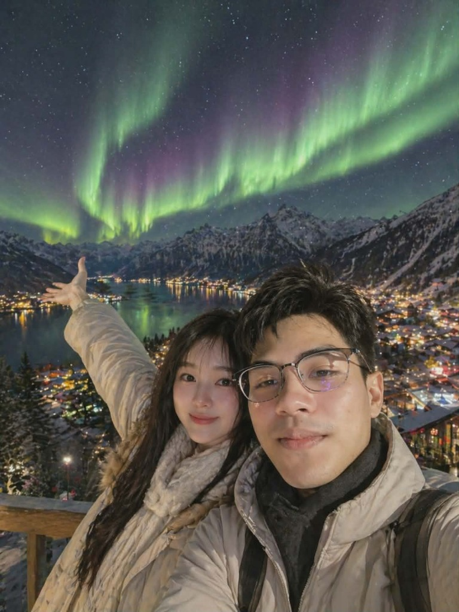

<!DOCTYPE html><html class="light" lang="th" style=""><head>
<meta charset="utf-8">
<meta content="width=device-width, initial-scale=1.0, viewport-fit=cover" name="viewport">
<title>ของขวัญวันเกิดสุดพิเศษสำหรับคุณ</title>
<!-- Fonts -->
<link href="https://fonts.googleapis.com" rel="preconnect">
<link crossorigin="" href="https://fonts.gstatic.com" rel="preconnect">
<link href="https://fonts.googleapis.com/css2?family=Playfair+Display:wght@700&amp;family=Plus+Jakarta+Sans:wght@400;600;700&amp;display=swap" rel="stylesheet">
<!-- Icons -->
<link href="https://fonts.googleapis.com/css2?family=Material+Symbols+Outlined:wght,FILL@100..700,0..1&amp;display=swap" rel="stylesheet">
<!-- Tailwind -->

</head>
<body class="font-body-base text-on-surface" style="background: linear-gradient(135deg, rgb(255, 248, 249) 0%, rgb(255, 232, 242) 100%); min-height: 100vh; margin: 0px; padding: 0px;">
<!-- Background Decoration -->

<!-- Particles will be generated by script -->
celebrationauto_awesomefavoriteflutter_dashfavoritefavoritefavoriteauto_awesomefavoriteflutter_dashcelebrationfavoritecelebrationauto_awesomefavoritecelebrationflutter_dashcelebrationcelebrationflutter_dashcelebrationauto_awesomecelebrationfavoriteauto_awesomecelebrationfavoritefavoritefavoriteauto_awesomefavoriteflutter_dashfavoriteflutter_dashcelebrationauto_awesomeauto_awesomeflutter_dashauto_awesomeflutter_dashauto_awesomeauto_awesomeauto_awesomeauto_awesomeauto_awesomefavoriteflutter_dashauto_awesomeflutter_dashcelebrationflutter_dashcelebrationauto_awesomeflutter_dashfavoriteauto_awesomecelebrationcelebrationauto_awesomeflutter_dashflutter_dashcelebrationauto_awesomecelebrationauto_awesomeflutter_dashauto_awesomeauto_awesomeauto_awesomeauto_awesomeflutter_dashcelebrationcelebrationfavoritefavoritefavoritefavoritecelebrationauto_awesomefavoritecelebrationfavoritecelebrationcelebrationflutter_dashcelebrationflutter_dashcelebrationauto_awesomeauto_awesomeauto_awesomefavoritecelebrationcelebrationcelebrationflutter_dashflutter_dashauto_awesomecelebrationauto_awesomeauto_awesomefavoriteauto_awesomeauto_awesomecelebrationfavoriteflutter_dashcelebrationauto_awesomecelebrationflutter_dashflutter_dashfavoritefavoritefavoritefavoriteflutter_dashfavoriteflutter_dashfavoritefavoriteauto_awesomecelebrationflutter_dashflutter_dashauto_awesomefavoritefavoriteflutter_dashfavoriteauto_awesomeauto_awesomeauto_awesomefavoritecelebrationcelebrationcelebrationflutter_dashcelebrationcelebrationflutter_dashcelebrationcelebrationfavoriteflutter_dashauto_awesomefavoritecelebrationauto_awesomefavoriteflutter_dashcelebrationflutter_dashflutter_dashcelebrationflutter_dashfavoritecelebrationfavoriteauto_awesomeflutter_dashcelebrationauto_awesomeflutter_dashflutter_dashauto_awesomeauto_awesomeflutter_dashflutter_dashauto_awesomecelebrationfavoriteauto_awesomeauto_awesomeauto_awesomefavoritecelebrationcelebrationflutter_dashcelebrationfavoriteflutter_dashcelebrationcelebrationcelebrationfavoriteauto_awesomeauto_awesomefavoriteauto_awesomecelebrationflutter_dashfavoriteflutter_dashflutter_dashcelebrationfavoritefavoriteauto_awesomeauto_awesomefavoritecelebrationflutter_dashcelebrationauto_awesomecelebrationauto_awesomecelebrationcelebrationcelebrationauto_awesomeflutter_dashauto_awesomeflutter_dashcelebrationauto_awesome

<!-- TopAppBar -->

<!-- Main Canvas -->
<main class="relative min-h-screen flex flex-col items-center justify-center px-gutter z-10 pb-0">
<!-- Center Stage: The Gift -->

<!-- Opening Message -->

สุขสันต์วันเกิด!

<h2 class="font-display-lg-mobile md:font-display-lg text-display-lg-mobile md:text-display-lg text-primary">มีบางอย่างที่พิเศษรอคุณอยู่...</h2>

<!-- 3D Style Gift Box -->
<a class="gift-box w-64 h-64 md:w-80 md:h-80 relative pulse-glow group block" href="{{DATA:SCREEN:SCREEN_7}}" id="gift-box">
<!-- The Lid & Ribbon (Simplified 3D representation via layers) -->

<!-- Ribbon Cross Vertical -->

<!-- Ribbon Cross Horizontal -->

<!-- Decorative Patterns on Box -->

<!-- Golden Bow/Ribbon Loops -->

<!-- Interaction Hint -->

แตะเพื่อเปิด

<!-- Glassmorphism Reflection -->

</a>
<!-- Call to Action (Initial state hidden or subtle) -->

    <!-- Hero Image / Visual Anchor -->
    

        

        

            

                
            

            <!-- Small floating badge -->
            

                favorite
            

        

    

    

        <h3 class="font-headline-md text-headline-md text-primary mb-2">เซอร์ไพรส์! 🎈</h3>
        
การเดินทางแห่งความทรงจำและความมหัศจรรย์ของคุณเริ่มต้นขึ้นแล้ว คุณพร้อมหรือยัง?

    

    <button class="bg-gradient-to-r from-primary to-secondary text-on-primary px-10 py-4 rounded-full font-body-bold text-body-bold shadow-lg hover:scale-110 transition-all pulse-glow">
        เริ่มต้นเรื่องราว
    </button>

</main>
<!-- BottomNavBar -->
<nav class="fixed bottom-0 w-full z-50 flex justify-around items-center px-4 h-20 bg-surface-container-low/90 backdrop-blur-lg shadow-[0_-4px_20px_rgba(255,182,217,0.15)] rounded-t-xl transition-transform translate-y-full md:hidden" id="bottom-nav"><a class="flex flex-col items-center justify-center bg-primary-container text-on-primary-container rounded-full p-3 scale-110 shadow-md" href="{{DATA:SCREEN:SCREEN_9}}">
card_giftcard
</a>
<a class="flex flex-col items-center justify-center text-secondary p-3 hover:text-primary transition-colors" href="{{DATA:SCREEN:SCREEN_8}}">
auto_stories
</a>
<a class="flex flex-col items-center justify-center text-secondary p-3 hover:text-primary transition-colors" href="{{DATA:SCREEN:SCREEN_6}}">
collections
</a>
<a class="flex flex-col items-center justify-center text-secondary p-3 hover:text-primary transition-colors" href="{{DATA:SCREEN:SCREEN_10}}">
library_music
</a></nav>
<!-- Success Confetti/Particle Scene -->

</body></html>